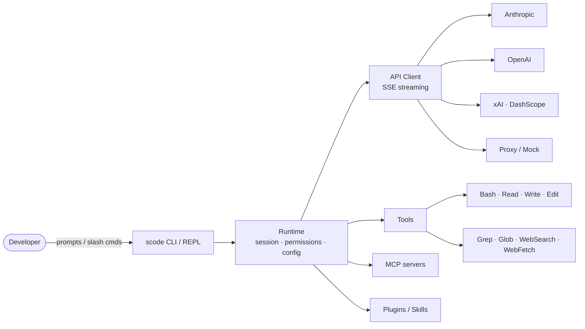

<!-- Language: 🇬🇧 English (this file) · [🇨🇳 简体中文](./README_zh.md) -->

# Sudo Code

<p align="center">
  
</p>

<p align="center">
  <a href="#license"></a>
  
  
  
  
  <a href="#contributing"></a>
</p>

<p align="center">
  <b>A fast, headless, provider-agnostic AI coding agent — written in Rust.</b><br/>
  Multi-provider auth · Agent Communication Protocol (ACP) · Native tool execution · ~20K lines of Rust.
</p>

---

## Why Sudo Code

`scode` is the open-source coding-agent engine that powers the **Sudowork** platform. It is designed for developers who want a transparent, scriptable, provider-agnostic agent that runs anywhere — from a terminal REPL to a headless server speaking ACP.

- ⚡ **Fast boot, lean runtime.** Built in Rust for low-latency startup and predictable resource use.
- 🛰 **Headless-first.** First-class ACP server mode for IDE integrations and orchestration backends.
- 🔌 **Multi-provider.** Anthropic, OpenAI, xAI, DashScope, OAuth subscriptions, and custom proxies — switch with a single flag.
- 🧰 **Batteries included.** Rich slash-command surface covering sessions, plugins, permissions, git, MCP, and review workflows.
- 🧪 **Deterministic mock harness.** A bundled Anthropic-compatible mock service lets you exercise the full agent loop with **zero API keys**.
- 🩺 **Built-in diagnostics.** `scode doctor` reports auth, providers, MCP, and config health in one command.

## Architecture



Nine crates, one binary. See [`rust/README.md`](./rust/README.md) for crate-level responsibilities.

## Installation

```bash
git clone https://github.com/sudoprivacy/sudocode.git
cd sudocode/rust
cargo build --release

# Binary is at ./target/release/scode
```

Requires a recent stable Rust toolchain (2021 edition). macOS and Linux are supported.

## Quick Start

```bash
# Set your credentials (pick one)
export ANTHROPIC_API_KEY="sk-ant-..."             # direct API key
export CLAUDE_CODE_OAUTH_TOKEN="sk-ant-oat-..."   # Claude subscription token
# or use a proxy:
export PROXY_AUTH_TOKEN="your-token"
export PROXY_BASE_URL="https://your-proxy.com"

# Interactive REPL
scode

# One-shot prompt
scode "explain this codebase"

# Health check
scode doctor
```

## Try without an API key

`scode` ships with a deterministic, Anthropic-compatible mock service. You can drive the full agent loop end-to-end without signing up for anything:

```bash
# Terminal 1 — start the local mock service on a fixed port
cd rust
cargo run -p mock-anthropic-service -- --bind 127.0.0.1:8787

# Terminal 2 — point scode at it via the proxy auth mode
export PROXY_BASE_URL="http://127.0.0.1:8787"
export PROXY_AUTH_TOKEN="mock"
cargo run --bin scode -- --auth proxy "say hi"
```

This is the same service that powers the workspace's parity harness, so the responses you see are deterministic and reproducible. For the scripted version, run:

```bash
cd rust && ./scripts/run_mock_parity_harness.sh
```

> [!NOTE]
> The mock service returns canned, scripted responses suitable for evaluating the runtime, tool dispatch, and streaming UI — not for live reasoning.

## Authentication

`scode` supports three authentication modes. Use `--auth` to select one explicitly, or let auto-detection pick (`subscription` > `proxy` > `api-key`).

```bash
scode --auth api-key          # uses ANTHROPIC_API_KEY, OPENAI_API_KEY, etc.
scode --auth subscription     # uses CLAUDE_CODE_OAUTH_TOKEN
scode --auth proxy            # uses PROXY_AUTH_TOKEN + PROXY_BASE_URL
```

| Mode | Environment variables | Endpoint |
|------|----------------------|----------|
| `api-key` | `ANTHROPIC_API_KEY`, `OPENAI_API_KEY`, `XAI_API_KEY`, `DASHSCOPE_API_KEY` | Provider default |
| `subscription` | `CLAUDE_CODE_OAUTH_TOKEN` (run `claude setup-token` to get one) | `api.anthropic.com` |
| `proxy` | `PROXY_AUTH_TOKEN` + `PROXY_BASE_URL` | `PROXY_BASE_URL` |

## Model Aliases

Short names resolve to the current pinned model versions:

| Alias | Resolves to | Provider |
|-------|-------------|----------|
| `opus` | `claude-opus-4-6` | Anthropic |
| `sonnet` | `claude-sonnet-4-6` | Anthropic |
| `haiku` | `claude-haiku-4-5` | Anthropic |
| `grok` | `grok-3` | xAI |

```bash
scode --model opus
scode --model sonnet --auth subscription
```

## Slash Commands

The REPL surface is much broader than a minimal shell. Tab-complete from `/` to discover. A representative subset:

| Category | Commands |
|----------|----------|
| Session & visibility | `/help` · `/status` · `/sandbox` · `/cost` · `/resume` · `/session` · `/usage` · `/stats` · `/version` |
| Workspace & git | `/compact` · `/clear` · `/config` · `/memory` · `/init` · `/diff` · `/commit` · `/pr` · `/issue` · `/export` · `/files` · `/release-notes` |
| Discovery & debugging | `/mcp` · `/agents` · `/skills` · `/doctor` · `/tasks` · `/context` · `/desktop` · `/hooks` |
| Automation & analysis | `/review` · `/advisor` · `/insights` · `/security-review` · `/subagent` · `/telemetry` · `/providers` · `/cron` |
| Plugin management | `/plugin` (aliases: `/plugins`, `/marketplace`) |

For the canonical, live command list:

```bash
cargo run --bin scode -- --help
```

## Diagnostics: `scode doctor`

One command, full picture. `scode doctor` reports:

- Auth mode resolution (which env vars are present, which mode would be selected)
- Provider reachability and credential validation
- MCP server status (configured, running, last error)
- Config file resolution (`.scode.json` hierarchy + merged result)
- Permission policy and sandbox mode
- Tool registry and skills inventory

Run it before filing an issue — most setup problems surface here first.

```bash
scode doctor
```

> [!WARNING]
> The default permission mode is `danger-full-access`. Set `--permission-mode` (or `permissionMode` in `.scode.json`) to tighten this before running against untrusted prompts or in shared environments.

## Documentation

- [Usage Guide](./rust/USAGE.md) — commands, integration, local models
- [Rust Workspace](./rust/README.md) — crate architecture, mock parity harness, internals
- [Model Compatibility](./docs/MODEL_COMPATIBILITY.md) — provider/model support matrix
- [Container build](./docs/container.md) — `Containerfile` usage

## Contributing

Issues and pull requests are welcome. Before opening a PR:

```bash
cd rust
scripts/fmt.sh                                   # or: cargo fmt
cargo clippy --workspace --all-targets -- -D warnings
cargo test --workspace
```

Star the repo if `scode` is useful to you — it helps others find the project.

## Star History

<p align="center">
  
</p>

## Lineage & credits

Sudo Code was originally forked from [`ultraworkers/claw-code`](https://github.com/ultraworkers/claw-code) (last synced: 2026-04-23) and has since evolved into a standalone, ACP-native engine. Thanks to the upstream authors for the starting point.

## License

Sudo Code is released under the **MIT License**. See the per-crate license fields in [`rust/Cargo.toml`](./rust/Cargo.toml).

---

Sudo Code is a community-driven project. Not affiliated with or endorsed by Anthropic.
