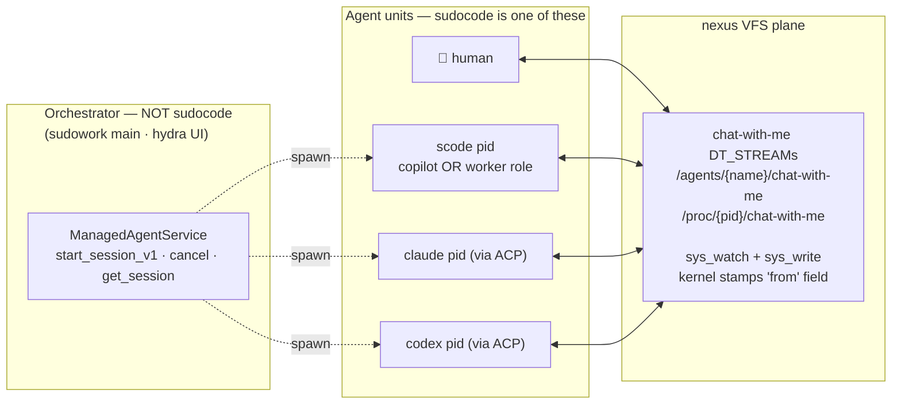
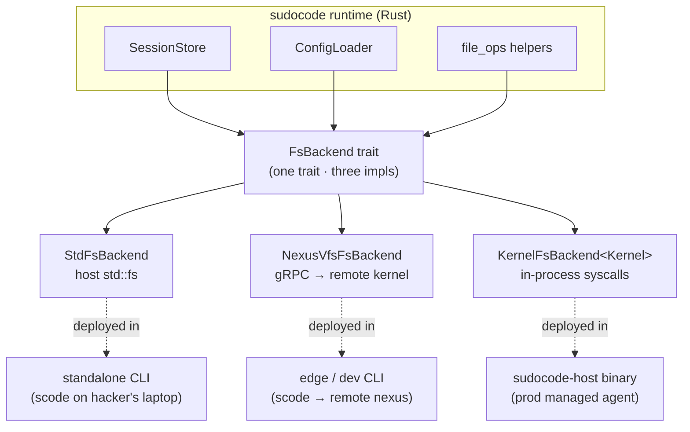
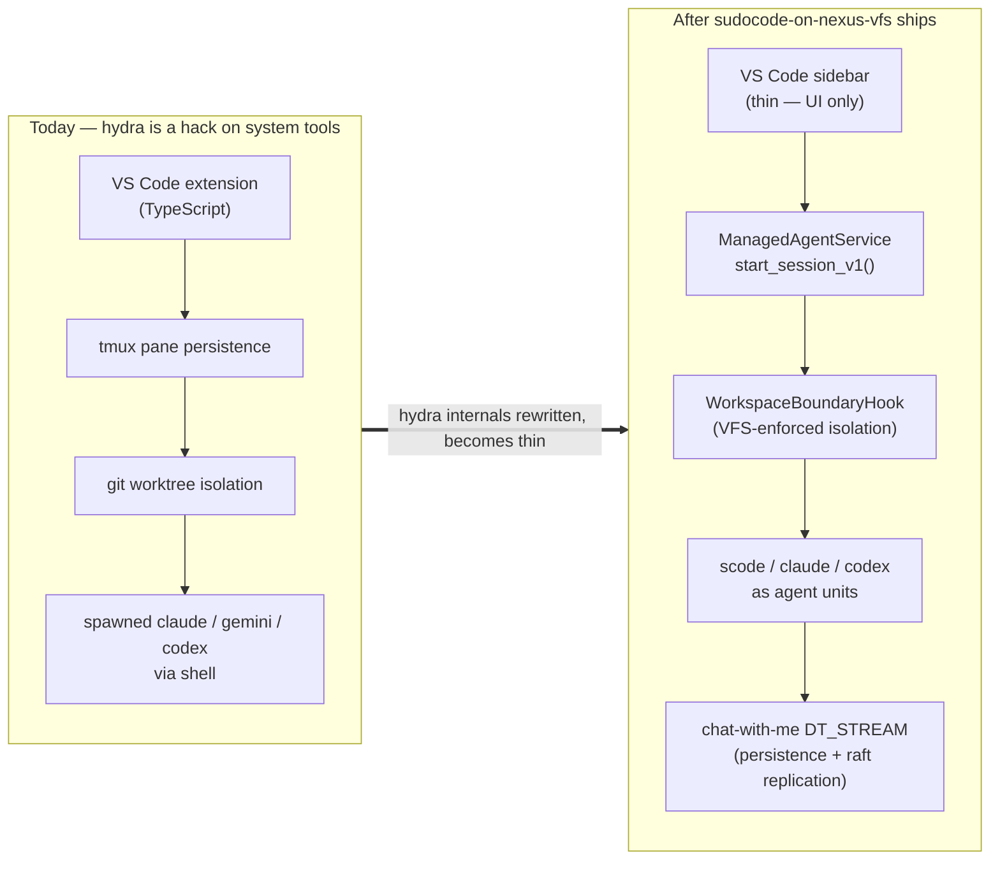
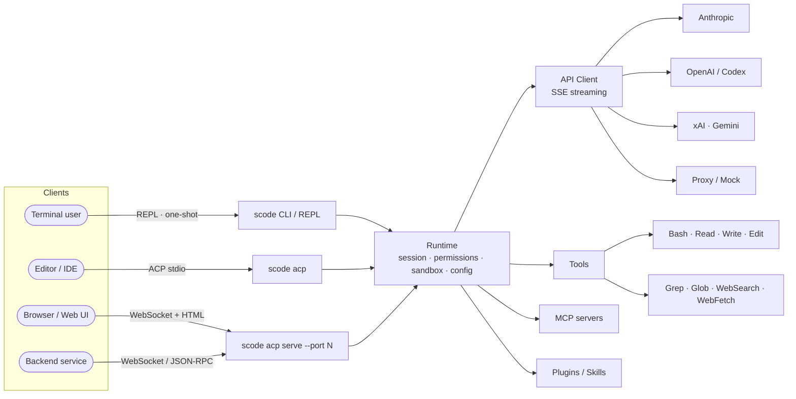

<!--
  Rust-native CLI coding agent for hackers — terminal-native,
  pipe-composable, scrollback-safe. Built because Claude Code chose
  non-coders. This README is the canonical voice; sudo-code-roadmap.html holds
  the engineering plan; docs/ holds mechanism-level reference.
-->

# SUDO CODE

<p align="center">
  
</p>

<p align="center">
  <a href="#license"></a>
  
  
  
  
  <a href="./CONTRIBUTING.md"></a>
</p>

## FOR HACKERS.

**Built because Claude Code chose non-coders.**

There was a time when Claude Code was a real coding agent —
opinionated, fast, debuggable. The pivot toward onboarding the 99%
changed that: hidden options because "users might misclick", forced
auto-updates overriding pinned versions, new surface shipping while
core surface stayed broken, heavy-user issues going unanswered.

Sudo Code is what happens when a heavy user gives up asking and
starts building.

Rust-native CLI. Inline only — never hijacks your terminal.
Pipe-composable — works with your shell, doesn't replace it.
Model-agnostic — your subscription, your choice. Open source — your
fork, your call.

<p align="center">
  
</p>

---

## Who this is for

| FOR | NOT FOR |
|---|---|
| The 1% by daily agent token-burn | First-time coders looking for tutorials |
| Engineers who live in `tmux`, `ssh`, `vscode terminal` | Anyone who wants a GUI |
| Engineers the system, not the steps — roles, DoD, reviewers; scales 1 → 10 → 100 agents | Drives one agent at a time, prompt by prompt |
| Wants the process fully exposed — "reading `src/auth.rs:42-89`" not "reading file" — to scan-and-catch | Wants the agent to handle details and surface only the result |
| Owns the stack they run — pinned versions, readable sessions, forks when needed | Runs whatever the vendor pushes next |

Every row is a productivity differentiator, not a status one. The
left column pushes productivity further by **engineering the
interaction**; the right column saves cognitive load by **trusting
the tool**. Sudo Code optimizes the first axis — which is why we
expose full process by default. Not for staring. For scan-and-catch
when something is off, and zero ceremony when it's not.

The end-state of this workflow is one heavy user shipping at the
productivity of a small team. The arc looks like **1 session →
7-10 parallel sessions → copilot-worker fleets of 100+ agents**.
At stage 1 you drive one agent. At stage 2 you parallelise long
unattended tasks — until mental bandwidth caps around ten. At
stage 3 a copilot agent reviews worker agents; you supervise the
copilot, the copilot does the per-agent direction, and the fleet
scales past anything one person could track. Sudo Code is the
agent unit at every stage. The collaboration plane that makes
stage 3 real is described in
[Position in the larger picture](#position-in-the-larger-picture)
below.

If the right column is you, this isn't your tool — and that's not a
problem to solve. **Claude Code, Cursor, GitHub Copilot are excellent
for the 99%; use those.** Sudo Code is opinionated against the right
column on purpose. We don't ship modes that bridge the gap, and we
don't apologize for that.

---

## Design principles

Two columns: what we'll always do, what we'll never do. These aren't
aspirations — they're constraints that shape every PR.

### Always

| | |
|---|---|
| **Open source. MIT. Forever.** | No secret-sauce room, no "real enterprise tier behind a wall". |
| **Model-agnostic.** | Your subscription, your key, your proxy. We bind to no vendor. |
| **Headless first-class.** | What you see in REPL is what runs as a service — same binary, same surface. |
| **Local-first.** | Zero telemetry by default. Your prompts don't leave your machine unless you tell them to. |
| **Inline only.** | Your terminal stays yours. Scrollback, tmux, ssh, vscode terminal — all preserved. |
| **Sole goal: heavy-user productivity.** | Every design decision filters through "does this compress wall-clock between a heavy user's thought and outcome?" If not, it doesn't ship. Comfort, onboarding, compatibility for the 99% — explicitly not our problem. |
| **Stable surface. No silent updates.** | Semver. Breaking change = major bump + release notes. You pin a version, that version stays. |
| **Everything is file.** | Config in `.scode.json`. Sessions in jsonl. Plugins on the filesystem. Future state on the [nexus VFS](https://github.com/nexi-lab/nexus) — every secret, stream, agent, audit trace addressable through `sys_read` / `sys_write`. No opaque DBs. No sibling APIs hiding state. |
| **Session is yours.** | jsonl you can read, fork, replay, `awk` through. Zero lock-in. |
| **Dogfood non-negotiable.** | The team burns this binary daily. No-dogfood, no release. |
| **Polish before scope.** | New surface doesn't ship while existing surface is broken. Scope expansion is an admission of failure on the core, not an upgrade. |

### Never

| | |
|---|---|
| **Closed source.** | No proprietary fork. The repo you see is everything. |
| **Force auto-update.** | You pin, you stay. Forced silent updates is one of the reasons sudocode exists. |
| **Premium features behind a paywall.** | One binary. No free/pro split. |
| **Alternate-screen TUI.** | Never hijack your screen. Inline ANSI only. No `ratatui`, no split-pane, no `--tui` flag. |
| **In-CLI multi-agent dashboard.** | We're a unit. Dashboards belong in sudowork / your tmux / your IDE. |
| **Vendor lock.** | No proprietary model API. No proprietary protocol — ACP is open. |
| **Telemetry by default.** | Opt-in is explicit. Not buried in EULA clause 47. |
| **CLA / copyright assignment.** | Contributors keep their copyright. Commit directly. |
| **Pivot away from hackers.** | If we ever do, **we fork ourselves**. |
| **"Some users might misclick" as a reason.** | Hidden options behind config because the 99% might fumble = treating us like the 99%. We're not. Either ship a feature, or don't. |

---

## Position in the larger picture

**Sudo Code is a unit, not a hub.** It plugs into a larger
collaboration plane through one shared primitive: the `chat-with-me`
mailbox on the [nexus VFS](https://github.com/nexi-lab/nexus).
Orchestration, multi-agent UI, fleet management — none of that is
our job. Sudo Code is the well-behaved agent unit that other
surfaces can drive: a human in a [sudowork](https://sudowork.sudoprivacy.com)
chat, a [hydra](https://github.com/sudoprivacy/hydra)-style
orchestrator, another sudocode running as copilot, a peer agent like
Claude or Codex on ACP. Same primitive, same plane.

### Topology — sudocode is one box among peers



Sudo Code is interchangeable with `claude` / `codex` / a human at the
mailbox primitive. It does not sit in the orchestrator box.

### One binary, three deployment modes

Same `scode` binary is a copilot, a worker, or a standalone CLI —
chosen by which `FsBackend` impl the runtime routes through:



### Hydra evolution

[Hydra](https://github.com/sudoprivacy/hydra) — today a TypeScript
VS Code extension shelling out to tmux + git worktrees to spawn
Claude / Gemini / Codex — gets thin once `sudocode-host` lands:



Sudo Code is the agent unit underneath that whole future picture.
For the engineering plan to get there, see
[`sudo-code-roadmap.html` § Goal 4](./sudo-code-roadmap.html).

---

## Install

```bash
curl -fsSL https://raw.githubusercontent.com/sudoprivacy/sudocode/main/install.sh | sh
```

`install.sh` downloads the prebuilt `scode` binary for the host
platform (macOS arm64/x64, Linux x64/arm64) and verifies a SHA-256
checksum. On macOS Apple Silicon: `/opt/homebrew/bin`. On macOS x64
and Linux: `/usr/local/bin`, prompting for `sudo` only when stdin is
a TTY. When the preferred system directory is unwritable and `sudo`
is unavailable, the script installs to `$HOME/.local/bin`. Windows
users grab the zip from the
[Releases page](https://github.com/sudoprivacy/sudocode/releases/latest).

Overrides:

- `SCODE_VERSION=v0.1.5 sh install.sh` — pin a specific release.
- `sh install.sh --no-sudo` — install to `$HOME/.local/bin`.
- `SCODE_INSTALL_DIR=$HOME/.local/bin sh install.sh` — explicit per-user install.
- `sh install.sh --prefix /usr/local` — explicit prefix.

China mirror (checksums still verified against GitHub):

```bash
SCODE_MIRROR=https://sudowork-download-1309794936.cos.ap-beijing.myqcloud.com/sudocode/release/latest \
  curl -fsSL https://raw.githubusercontent.com/sudoprivacy/sudocode/main/install.sh | sh
```

## Build from source

```bash
git clone https://github.com/sudoprivacy/sudocode.git
cd sudocode/rust
cargo build --release
# Binary at ./target/release/scode
```

Requires a recent stable Rust 2021 toolchain.

## Quick Start

```bash
# Pick an auth mode (see docs/authentication.md)
export CLAUDE_CODE_OAUTH_TOKEN="sk-ant-oat-..."

# Interactive REPL
scode

# One-shot prompt — pipe-composable, like every unix tool
scode "explain this codebase" | bat
scode "list failing tests" --output-format json | jq '.tests[]'

# Read a plan from stdin, resume a prior session
cat plan.md | scode --resume <session-id>

# Headless ACP server for editors / web clients
scode acp serve --port 8080

# Health check
scode doctor
```

For day-to-day workflows see [`docs/usage.md`](./docs/usage.md).

## Architecture — current implementation



The Cargo workspace is described in
[`rust/README.md`](./rust/README.md).

## Documentation

- [`sudo-code-roadmap.html`](./sudo-code-roadmap.html) — goals, design notes, engineering sequencing.
- [`docs/usage.md`](./docs/usage.md) — REPL, one-shot, JSON output, resume, doctor.
- [`docs/authentication.md`](./docs/authentication.md) — auth modes and credentials.
- [`docs/permissions-and-sandbox.md`](./docs/permissions-and-sandbox.md) — permission modes, Linux sandbox.
- [`docs/acp.md`](./docs/acp.md) — ACP transports and the embedded Web UI.
- [`docs/models.md`](./docs/models.md) — aliases, provider-specific handling.
- [`docs/plugins.md`](./docs/plugins.md) — authoring and using `scode` plugins.
- [`docs/container.md`](./docs/container.md) — building and running inside a container.
- [`sudo-code-roadmap.html`](./sudo-code-roadmap.html) Goal 2 — what claude-code parity means and how it is tracked (reference sources, resolution taxonomy, sync markers).
- [`docs/mock-parity-harness.md`](./docs/mock-parity-harness.md) — the deterministic mock backend and harness.
- [`rust/README.md`](./rust/README.md) — Cargo workspace map.

## Contributing

See [`CONTRIBUTING.md`](./CONTRIBUTING.md). Contributors keep their
copyright — no CLA, no assignment, no waivers. Commit directly.

Chinese-speaking hackers: open issues and PRs in Chinese on the
GitHub issue tracker if it's faster for you. The canonical docs
(this README, ROADMAP, contracts) stay in English so there's one
source of truth, but conversations in any language are welcome.

## License

Released under the MIT License. See the per-crate license fields in
[`rust/Cargo.toml`](./rust/Cargo.toml).

---

Sudo Code is maintained by the Sudo Privacy community as the agent
unit underneath the [Sudowork](https://sudowork.sudoprivacy.com)
collaboration platform.
