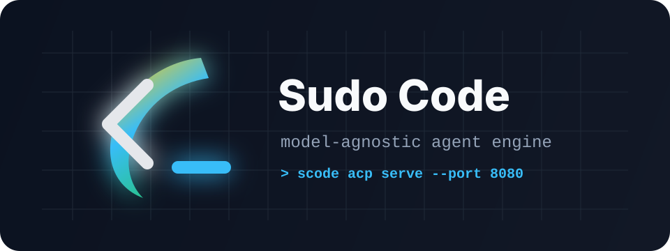
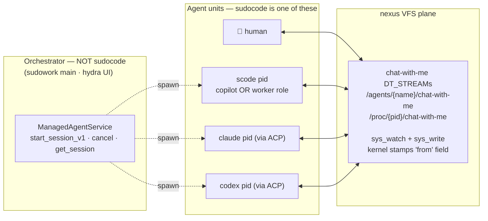
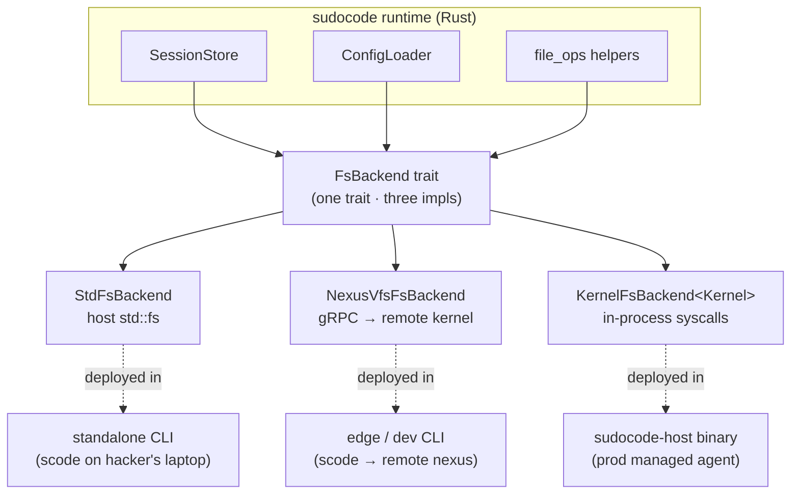
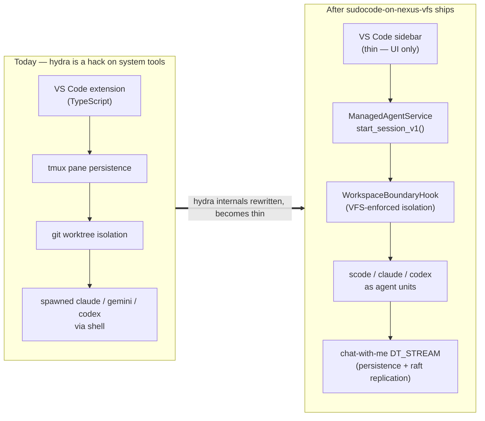
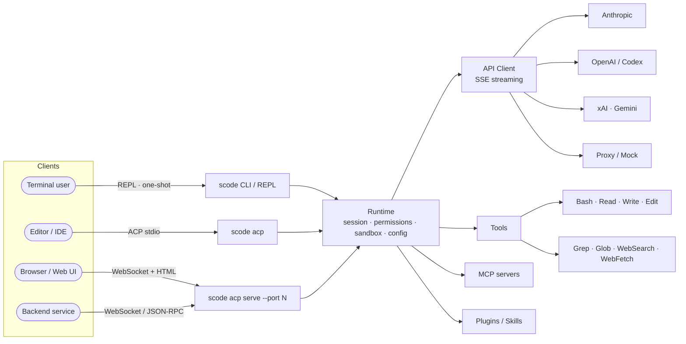

<!--
  Rust-native CLI coding agent for hackers — simple, inspectable,
  composable. This README is the canonical voice; sudo-code-roadmap.html holds
  the engineering plan; docs/ holds mechanism-level reference.
-->

# SUDO CODE

<p align="center">
  
</p>

<p align="center">
  <a href="#license"></a>
  
  
  
  
  <a href="./CONTRIBUTING.md"></a>
</p>

## FOR HACKERS.

**Less ceremony. More control.**

Sudo Code (`scode`) is a Rust-native CLI coding agent for people who
live in the terminal and want to understand, compose, and change the
tools they run. Inline interaction, shell pipes, headless ACP,
readable sessions, and a choice of model providers. MIT licensed.

The goal is simple: shorten the path from intent to verified work.
Keep the interface quiet, the important state visible, and the user
in control. A hacker tool should earn its place in your workflow,
not become the workflow.

<p align="center">
  
</p>

---

## Who this is for

For engineers who work in `tmux`, SSH, or an IDE terminal; automate
repeated work; inspect what an agent is doing; and expect to choose
their models, versions, and tools.

"Hacker" describes that relationship with a tool, not a token budget
or a minimum number of agents. One focused session is a complete
workflow. When work grows, compose sessions with worktrees, scripts,
reviewers, and external orchestrators — don't turn the CLI into a
dashboard. Sudo Code stays the
[agent unit](#position-in-the-larger-picture).

---

## Design principles

These are design constraints, not a claim that every implementation
already meets them. Bugs are gaps to close, not reasons to weaken
the principles.

### Always

| Principle | What it means in practice |
|---|---|
| **Simple, not stripped down.** | Fewer steps, fewer concepts, less visual noise. Keep useful controls accessible; simplicity must not mean hiding capability. |
| **Control and predictability.** | The user chooses providers, credentials, versions, and permissions. Make defaults understandable, actions interruptible, and consequential changes explicit. |
| **Evidence over reassurance.** | Show commands, paths, diffs, failures, and costs. Make important activity easy to scan and details available to inspect. "Reading `src/auth.rs:42–89`" beats "working on it". |
| **Protect work before appearance.** | Preserve input and terminal history during ordinary interaction and resize. A cleaner screen is never a reason to silently discard the user's record. |
| **Responsive under load.** | Typing, cancellation, and resize matter as much as first-token latency. Measure the real workflow, including memory across long sessions and parallel processes; Rust alone is not evidence of speed. |
| **Meaningful visual design.** | Amber is the primary accent. Use color, contrast, and spacing to distinguish state, not decorate it. Keep text readable and state understandable without color; no spectacle at the expense of clarity. |
| **Composable, headless first-class.** | Work with the shell, pipes, scripts, and editors. REPL and ACP share the engine; the CLI is an agent unit, not an orchestration hub. |
| **Local-first, inspectable state.** | File-based config, JSONL sessions, filesystem plugins. Keep state readable and portable. Model and tool traffic goes to the services the user configures; local-first does not mean offline. |
| **Polish before scope.** | Dogfood daily. Fix broken core interactions before adding surface area. Address causes at their owning layer, with one source of truth, rather than accumulating local workarounds. |

Your terminal history includes shell commands, build logs, and debug
output from before `scode` started. A saved agent session is not a
backup of all of that. If terminal limitations prevent a clean
redraw, report the limitation and preserve the record. Recovery that
discards history must be an explicit user choice, with the loss
explained beforehand — never an automatic resize fix.

The inline renderer measures terminal columns and keeps grapheme clusters
intact when wrapping responses, tables, and tool cards. Continued tool rows
retain their text styles. Amber remains the main accent; links use blue,
inline code uses violet, and warnings use yellow (ochre on light backgrounds).
Status summaries pass structured styles directly to iocraft. External ANSI
content is decoded at the boundary, and syntax grammars are loaded only when
needed and shared across turns.

### Never

| Boundary | Commitment |
|---|---|
| **Closed or paywalled core.** | Open source. MIT. Forever. No free/pro feature split in Sudo Code. |
| **Vendor lock-in.** | Your supported provider, subscription, key, or proxy. Open ACP integration; no mandatory model vendor. |
| **Alternate-screen TUI.** | Inline ANSI only. No `ratatui`, split-pane mode, or `--tui` flag. The terminal remains the host. |
| **In-CLI multi-agent dashboard.** | Orchestration UI belongs in sudowork, tmux, or your IDE. |
| **Telemetry by default.** | Opt-in must be explicit. |
| **CLA or copyright assignment.** | Contributors keep their copyright. MIT is the arrangement. |
| **Trading away user control for mass-market appeal.** | "Some users might misclick" is not a reason to hide a finished feature. Explain consequences; keep the controls. Unfinished experiments follow the [feature-flag policy](./CONTRIBUTING.md#experimental-features--standing-rule). |

---

## Position in the larger picture

**Sudo Code is a unit, not a hub.** It plugs into a larger
collaboration plane through one shared primitive: the `chat-with-me`
mailbox on the [nexus VFS](https://github.com/nexi-lab/nexus).
Orchestration, multi-agent UI, fleet management — none of that is
our job. Sudo Code is the well-behaved agent unit that other
surfaces can drive: a human in a [sudowork](https://sudowork.sudoprivacy.com)
chat, a [hydra](https://github.com/sudoprivacy/hydra)-style
orchestrator, another sudocode running as copilot, a peer agent like
Claude or Codex on ACP. Same primitive, same plane.

### Topology — sudocode is one box among peers


```mermaid
flowchart LR
    subgraph Orch["Orchestrator — NOT sudocode<br/>(sudowork main · hydra UI)"]
      O["ManagedAgentService<br/>start_session_v1 · cancel · get_session"]
    end

    subgraph Units["Agent units — sudocode is one of these"]
      direction TB
      H["👤 human"]
      SC["scode pid<br/>copilot OR worker role"]
      CL["claude pid (via ACP)"]
      CX["codex pid (via ACP)"]
    end

    subgraph Plane["nexus VFS plane"]
      MB["chat-with-me DT_STREAMs<br/>/agents/{name}/chat-with-me<br/>/proc/{pid}/chat-with-me<br/><br/>sys_watch + sys_write<br/>kernel stamps 'from' field"]
    end

    O -. spawn .-> SC
    O -. spawn .-> CL
    O -. spawn .-> CX

    H <--> MB
    SC <--> MB
    CL <--> MB
    CX <--> MB
```

Sudo Code is interchangeable with `claude` / `codex` / a human at the
mailbox primitive. It does not sit in the orchestrator box.

### One binary, three deployment modes

Same `scode` binary is a copilot, a worker, or a standalone CLI —
chosen by which `FsBackend` impl the runtime routes through:


```mermaid
flowchart TB
    subgraph Runtime["sudocode runtime (Rust)"]
      direction LR
      SES["SessionStore"]
      CFG["ConfigLoader"]
      FOPS["file_ops helpers"]
    end

    TRAIT["FsBackend trait<br/>(one trait · three impls)"]

    SES --> TRAIT
    CFG --> TRAIT
    FOPS --> TRAIT

    TRAIT --> B1["StdFsBackend<br/>host std::fs"]
    TRAIT --> B2["NexusVfsFsBackend<br/>gRPC → remote kernel"]
    TRAIT --> B3["KernelFsBackend&lt;Kernel&gt;<br/>in-process syscalls"]

    B1 -.deployed in.-> M1["standalone CLI<br/>(scode on hacker's laptop)"]
    B2 -.deployed in.-> M2["edge / dev CLI<br/>(scode → remote nexus)"]
    B3 -.deployed in.-> M3["sudocode-host binary<br/>(prod managed agent)"]
```

### Hydra evolution

[Hydra](https://github.com/sudoprivacy/hydra) — today a TypeScript
VS Code extension shelling out to tmux + git worktrees to spawn
Claude / Gemini / Codex — gets thin once `sudocode-host` lands:


```mermaid
flowchart LR
    subgraph Today["Today — hydra is a hack on system tools"]
      direction TB
      T1["VS Code extension<br/>(TypeScript)"]
      T2["tmux pane persistence"]
      T3["git worktree isolation"]
      T4["spawned claude / gemini / codex<br/>via shell"]
      T1 --> T2 --> T3 --> T4
    end

    subgraph Future["After sudocode-on-nexus-vfs ships"]
      direction TB
      F1["VS Code sidebar<br/>(thin — UI only)"]
      F2["ManagedAgentService<br/>start_session_v1()"]
      F3["WorkspaceBoundaryHook<br/>(VFS-enforced isolation)"]
      F4["scode / claude / codex<br/>as agent units"]
      F5["chat-with-me DT_STREAM<br/>(persistence + raft replication)"]
      F1 --> F2 --> F3 --> F4 --> F5
    end

    Today ==>|"hydra internals rewritten, becomes thin"| Future
```

Sudo Code is the agent unit underneath that whole future picture.
For the engineering plan to get there, see
[`sudo-code-roadmap.html` § Goal 4](./sudo-code-roadmap.html).

---

## Install

```bash
curl -fsSL https://raw.githubusercontent.com/sudoprivacy/sudocode/main/install.sh | sh
```

`install.sh` downloads the prebuilt `scode` binary for the host
platform (macOS arm64/x64, Linux x64/arm64) and verifies a SHA-256
checksum. On macOS Apple Silicon: `/opt/homebrew/bin`. On macOS x64
and Linux: `/usr/local/bin`, prompting for `sudo` only when stdin is
a TTY. When the preferred system directory is unwritable and `sudo`
is unavailable, the script installs to `$HOME/.local/bin`. Windows
users grab the zip from the
[Releases page](https://github.com/sudoprivacy/sudocode/releases/latest).

Overrides:

- `SCODE_VERSION=v0.1.5 sh install.sh` — pin a specific release.
- `sh install.sh --no-sudo` — install to `$HOME/.local/bin`.
- `SCODE_INSTALL_DIR=$HOME/.local/bin sh install.sh` — explicit per-user install.
- `sh install.sh --prefix /usr/local` — explicit prefix.

China mirror (checksums still verified against GitHub):

```bash
curl -fsSL https://sudowork-release-1309794936.cos.ap-beijing.myqcloud.com/sudocode/release/latest/install.sh | \
  SCODE_MIRROR=https://sudowork-release-1309794936.cos.ap-beijing.myqcloud.com/sudocode/release/latest sh
```

## Build from source

```bash
git clone https://github.com/sudoprivacy/sudocode.git
cd sudocode/rust
cargo build --release
# Binary at ./target/release/scode
```

Requires a recent stable Rust 2021 toolchain.

## Quick Start

```bash
# Pick an auth mode (see docs/authentication.md)
export CLAUDE_CODE_OAUTH_TOKEN="sk-ant-oat-..."

# Interactive REPL
scode

# One-shot prompt — pipe-composable, like every unix tool
scode "explain this codebase" | bat
scode --output-format json prompt "list failing tests" | jq .

# Read a plan from stdin, resume a prior session
cat plan.md | scode --resume <session-id>

# Headless ACP server for editors / web clients
scode acp serve --port 8080

# Health check
scode doctor
```

For day-to-day workflows see [`docs/usage.md`](./docs/usage.md).

## Architecture — current implementation


```mermaid
flowchart LR
    subgraph Clients
      Term([Terminal user])
      Editor([Editor / IDE])
      Browser([Browser / Web UI])
      Service([Backend service])
    end

    Term -->|REPL · one-shot| CLI
    Editor -->|ACP stdio| STDIO[scode acp]
    Browser -->|WebSocket + HTML| WS[scode acp serve --port N]
    Service -->|WebSocket / JSON-RPC| WS

    CLI[scode CLI / REPL] --> RT
    STDIO --> RT
    WS --> RT

    RT[Runtime<br/>session · permissions · sandbox · config] --> API[API Client<br/>SSE streaming]
    RT --> TOOLS[Tools]
    RT --> MCP[MCP servers]
    RT --> PLUG[Plugins / Skills]

    TOOLS --> T1[Bash · Read · Write · Edit]
    TOOLS --> T2[Grep · Glob · WebSearch · WebFetch]

    API --> P1[Anthropic]
    API --> P2[OpenAI / Codex]
    API --> P3[xAI · Gemini]
    API --> P4[Proxy / Mock]
```

The Cargo workspace is described in
[`rust/README.md`](./rust/README.md).

## Documentation

- [`sudo-code-roadmap.html`](./sudo-code-roadmap.html) — goals, design notes, engineering sequencing.
- [`docs/usage.md`](./docs/usage.md) — REPL, one-shot, JSON output, resume, doctor.
- [`docs/authentication.md`](./docs/authentication.md) — auth modes and credentials.
- [`docs/permissions-and-sandbox.md`](./docs/permissions-and-sandbox.md) — permission modes, Linux sandbox.
- [`docs/acp.md`](./docs/acp.md) — ACP transports and the embedded Web UI.
- [`docs/models.md`](./docs/models.md) — aliases, provider-specific handling.
- [`docs/plugins.md`](./docs/plugins.md) — authoring and using `scode` plugins.
- [`docs/container.md`](./docs/container.md) — building and running inside a container.
- [`sudo-code-roadmap.html`](./sudo-code-roadmap.html) Goal 2 — what claude-code parity means and how it is tracked (reference sources, resolution taxonomy, sync markers).
- [`docs/mock-parity-harness.md`](./docs/mock-parity-harness.md) — the deterministic mock backend and harness.
- [Memory systems comparison](./docs/research/memory-systems-2026-10-01/memory-systems-comparison.html) — a dated source investigation of Codex CLI, Claude Code, and Sudocode; [read and discuss on ShareOne](https://s.shareone.vip/s/codex-claude-code-sudocode-memory-systems).
- [`rust/README.md`](./rust/README.md) — Cargo workspace map.

## Contributing

See [`CONTRIBUTING.md`](./CONTRIBUTING.md). Contributors keep their
copyright — no CLA, no assignment, no waivers. Commit directly.

Chinese-speaking hackers: open issues and PRs in Chinese on the
GitHub issue tracker if it's faster for you. The canonical docs
(this README, ROADMAP, contracts) stay in English so there's one
source of truth, but conversations in any language are welcome.

## License

Released under the MIT License. See the per-crate license fields in
[`rust/Cargo.toml`](./rust/Cargo.toml).

---

Sudo Code is maintained by the Sudo Privacy community as the agent
unit underneath the [Sudowork](https://sudowork.sudoprivacy.com)
collaboration platform.
