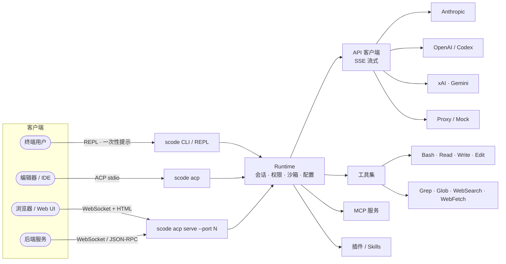

<!-- Language: [🇬🇧 English](./README.md) · 🇨🇳 简体中文 (this file) -->

# Sudo Code

<p align="center">
  
</p>

<p align="center">
  <a href="#许可证"></a>
  
  
  
  
  
  <a href="#参与贡献"></a>
</p>

<p align="center">
  <b>面向 AI 代理时代的引擎。</b><br/>
  Rust 原生 · 模型无关 · Headless 优先 · 默认安全。
</p>

---

## Sudo Code 是什么？

**Sudo Code**（`scode`）是一个用 Rust 实现的高性能编码代理 —— 与 Claude Code、Aider 等同属一类 —— 但从一开始就同时面向两类使用者：**终端前的开发者**与**网络上的程序**。

- **模型无关。** 一等公民式支持 Anthropic、OpenAI、xAI 与 Gemini，同时支持 OAuth 订阅与任意代理后端。通过 `--auth` / `--model` 一条参数即可切换。
- **以性能为先的运行时。** 单个原生二进制，不带 Node/Python 的启动开销。基于 Rust 与 `tokio` 构建，内存占用精简、关闭确定、负载下行为可预测。
- **Headless 基础设施。** `scode acp serve` 通过 **stdio**（面向编辑器与命令行编排）与 **WebSocket**（面向浏览器、IDE 插件、服务后端）两种传输同时暴露 **Agent Communication Protocol**，让 `scode` 真正变成「Agent as a Service」。
- **内嵌 Web UI。** WebSocket 模式自带一个交互式 Web 客户端。执行 `scode acp serve --port 8080`，浏览器打开 `http://localhost:8080/`，无需任何额外安装即可获得可用的 Agent UI。
- **默认安全。** 加固的权限系统提供清晰的模式（`read-only`、`workspace-write`、`danger-full-access`），并在 Linux 上基于 user namespace 提供文件系统与网络隔离的沙箱。

这不仅是一个 fork —— 而是一套灵活的基础设施，用于构建、运行、嵌入编码代理，可部署到从开发者本机到生产服务网格的任何地方。

## 架构概览



9 个 crate，1 个二进制。crate 级别的职责拆分见 [`rust/README.md`](./rust/README.md)。

## 安装

```bash
git clone https://github.com/sudoprivacy/sudocode.git
cd sudocode/rust
cargo build --release

# 二进制位于 ./target/release/scode
```

需要较新的 stable Rust 工具链（2021 edition）。已支持 macOS 与 Linux。

## 快速开始

```bash
# 配置凭据（任选其一）
export ANTHROPIC_API_KEY="sk-ant-..."             # 直连 API Key
export CLAUDE_CODE_OAUTH_TOKEN="sk-ant-oat-..."   # Claude 订阅 Token
# 或使用代理：
export PROXY_AUTH_TOKEN="your-token"
export PROXY_BASE_URL="https://your-proxy.com"

# 交互式 REPL
scode

# 一次性提示
scode "解释这个代码库"

# 健康检查
scode doctor
```

## 作为基础设施运行 —— `scode acp serve`

`scode` 原生支持 **Agent Communication Protocol (ACP)**，提供两种传输：

```bash
# 1) stdio —— 面向编辑器、IDE 插件、命令行编排
scode acp

# 2) WebSocket + 内嵌 Web UI —— 面向浏览器与服务后端
scode acp serve --port 8080
#   → JSON-RPC over WebSocket：  ws://localhost:8080/ws
#   → 交互式 Web UI：             http://localhost:8080/
```

两种传输**共用同一套处理器链路**，因此 WebSocket 客户端可以获得与 stdio 完全一致的能力 —— 包括流式输出、工具调用、信息征询（elicitation）与权限弹窗。这让 `scode` 成为一个可以直接嵌入的 Agent 内核：

- **编辑器插件**（Zed、VS Code、JetBrains）—— 通过 stdio 接入 ACP。
- **Web 应用与控制台** —— 通过 WebSocket 端点接入，或直接用浏览器访问 `/` 使用内嵌 UI。
- **自动化流水线与微服务** —— 将 `scode acp serve` 作为长驻进程部署在负载均衡之后。
- **子代理与编排器** —— 通过线上协议把任务分发到多个 `scode` 实例。

> [!TIP]
> 内嵌 Web UI 是零安装地演示、调试或共享 Agent 会话的最快路径。本地使用请绑定到 `127.0.0.1`；如需团队共享，请将端口暴露在你自己的鉴权代理之后。

## 开发者模式：零配置协议调试

`scode` 自带一个确定性、Anthropic 兼容的 Mock 服务，专为面向 Agent 内核的工程联调而设计 —— 不用于真实推理。它可以让你在**不消耗任何 API 额度**的前提下，端到端验证 **ACP 协议集成**、**工具调度逻辑**与 **UI / 流式行为**。

典型使用场景：

- 验证通过 stdio 接入 ACP 的编辑器 / IDE 插件。
- 针对 WebSocket 客户端（含内嵌 Web UI）进行冒烟测试，命中与生产同一套处理器链路。
- 为工具调度、权限弹窗与 SSE 流式编写 CI 集成测试，无需担心抖动或额度限制。
- 调试新的 Provider 适配器或代理，不必消耗真实 Token。

**调试工作流 —— 让 `scode` 指向本地 Mock：**

```bash
# 终端 1 —— 在固定端口启动确定性 Mock 服务
cd rust
cargo run -p mock-anthropic-service -- --bind 127.0.0.1:8787

# 终端 2 —— 通过 proxy 鉴权模式把 scode 路由到 Mock
export PROXY_BASE_URL="http://127.0.0.1:8787"
export PROXY_AUTH_TOKEN="mock"
cargo run --bin scode -- --auth proxy "say hi"
```

**调试工作流 —— 运行脚本化 parity 测试：**

这正是仓库 CI 用于 parity 校验的同一套 Harness。响应在不同机器、不同 CI 分片、多次运行之间都是确定且可复现的。

```bash
cd rust && ./scripts/run_mock_parity_harness.sh
```

> [!NOTE]
> Mock 服务返回的是脚本化、由固定 fixture 支撑的响应。它是协议、传输与 UI 层验证的正确工具，而不是评估模型质量的工具 —— 后者请指向真实的 Provider。

## 鉴权方式

`scode` 支持三种鉴权模式。可通过 `--auth` 显式指定，或交由自动检测选择（优先级：`subscription` > `proxy` > `api-key`）。

```bash
scode --auth api-key          # 使用 ANTHROPIC_API_KEY、OPENAI_API_KEY 等
scode --auth subscription     # 使用 CLAUDE_CODE_OAUTH_TOKEN
scode --auth proxy            # 使用 PROXY_AUTH_TOKEN + PROXY_BASE_URL
```

| 模式 | 环境变量 | Endpoint |
|------|----------|----------|
| `api-key` | `ANTHROPIC_API_KEY`、`OPENAI_API_KEY`、`XAI_API_KEY`、`GEMINI_API_KEY`、`DASHSCOPE_API_KEY` | 提供方默认 |
| `subscription` | `CLAUDE_CODE_OAUTH_TOKEN`（运行 `claude setup-token` 获取） | `api.anthropic.com` |
| `proxy` | `PROXY_AUTH_TOKEN` + `PROXY_BASE_URL` | `PROXY_BASE_URL` |

## 模型别名

短别名会解析到当前固定的模型版本：

| 别名 | 解析为 | 提供方 |
|------|--------|--------|
| `opus` | `claude-opus-4-6` | Anthropic |
| `sonnet` | `claude-sonnet-4-6` | Anthropic |
| `haiku` | `claude-haiku-4-5` | Anthropic |
| `grok` | `grok-3` | xAI |

```bash
scode --model opus
scode --model sonnet --auth subscription
```

## Slash 命令

REPL 暴露的命令面非常宽。直接输入 `/` 即可触发 Tab 补全。下表为代表性子集：

| 类别 | 命令 |
|------|------|
| 会话 & 可见性 | `/help` · `/status` · `/sandbox` · `/cost` · `/resume` · `/session` · `/usage` · `/stats` · `/version` |
| 工作区 & Git | `/compact` · `/clear` · `/config` · `/memory` · `/init` · `/diff` · `/commit` · `/pr` · `/issue` · `/export` · `/files` · `/release-notes` |
| 发现 & 调试 | `/mcp` · `/agents` · `/skills` · `/doctor` · `/tasks` · `/context` · `/desktop` · `/hooks` |
| 自动化 & 分析 | `/review` · `/advisor` · `/insights` · `/security-review` · `/subagent` · `/telemetry` · `/providers` · `/cron` |
| 插件管理 | `/plugin`（别名：`/plugins`、`/marketplace`） |

如需查看权威的、实时的命令列表：

```bash
cargo run --bin scode -- --help
```

## 安全：权限与沙箱

编码代理会动你的文件系统和 Shell —— `scode` 对此严肃以待。

**权限模式**对每一次工具调用进行门控：

| 模式 | 行为 |
|------|------|
| `read-only` | 所有文件系统与 Shell 写入操作被阻止；读类工具与 Web 工具仍可用。 |
| `workspace-write` | 写入仅限当前工作区；环境级的 Shell 写入被阻止。 |
| `prompt` | 每次特权工具调用都需要交互式批准。 |
| `allow` | 由调用方预先授权，用于非交互式自动化。 |
| `danger-full-access` | 无限制。当前默认值 —— 出于设计明确选择。 |

通过 `--permission-mode <MODE>` 或 `.scode.json` 中的 `permissionMode` 配置。

**Linux 沙箱**（仅在 Linux 上启用）：

- 基于 user namespace 的隔离（`unshare`），**无需 root**。
- 文件系统模式：`off`、`workspace-only`、`allow-list`（带显式挂载清单）。
- 可选的网络隔离。
- 容器感知：检测 Docker / Podman 并通过 `scode doctor` 与 `/sandbox` 回报。

```bash
scode --permission-mode workspace-write
scode sandbox --status               # 查看当前沙箱状态
```

> [!WARNING]
> 默认权限模式是 `danger-full-access`，因为 `scode` 的设计目标是「做事」，而不仅仅是「答题」。在不可信提示词或共享环境中使用前，请收紧权限。

## 诊断工具：`scode doctor`

一条命令，全景视角。`scode doctor` 会汇报：

- 鉴权模式解析结果（当前存在哪些环境变量、最终会选择哪种模式）
- 各提供方的可达性与凭据校验
- MCP 服务状态（已配置、运行中、最近错误）
- 配置文件解析（`.scode.json` 层级及合并结果）
- 权限策略与沙箱模式
- 工具注册表与 Skills 清单

提交 Issue 之前请先运行它 —— 大多数环境问题会在这里第一时间暴露。

```bash
scode doctor
```

## 更多文档

- [使用指南](./rust/USAGE.md) —— 命令、集成、本地模型
- [Rust Workspace](./rust/README.md) —— Crate 架构、Mock parity 测试、内部细节
- [模型兼容性](./docs/MODEL_COMPATIBILITY.md) —— 提供方 / 模型支持矩阵
- [容器构建](./docs/container.md) —— `Containerfile` 使用方式

## 参与贡献

欢迎提交 Issue 与 Pull Request。提 PR 前请在 `rust/` 下运行：

```bash
cd rust
scripts/fmt.sh                                   # 或：cargo fmt
cargo clippy --workspace --all-targets -- -D warnings
cargo test --workspace
```

如果 `scode` 对你有帮助，欢迎点 Star —— 这能帮助更多开发者发现这个项目。

## Star 趋势

<p align="center">
  
</p>

## 项目溯源

Sudo Code 最初 fork 自 [`ultraworkers/claw-code`](https://github.com/ultraworkers/claw-code)（最后同步：2026-04-23），此后已演进为独立的、ACP 原生、模型无关的代理引擎。感谢上游作者提供的起点。

## 许可证

Sudo Code 以 **MIT License** 协议开源。具体可见各 crate 在 [`rust/Cargo.toml`](./rust/Cargo.toml) 中的 license 字段。

---

Sudo Code 是社区驱动的项目，与 Anthropic 无关联、未获其官方背书。
