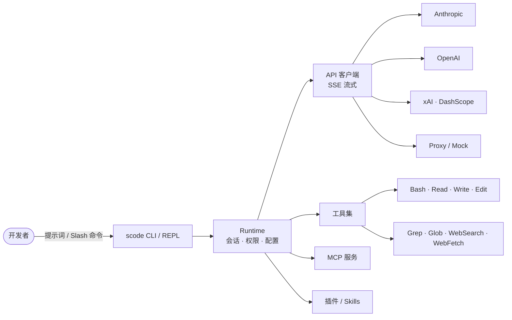

<!-- Language: [🇬🇧 English](./README.md) · 🇨🇳 简体中文 (this file) -->

# Sudo Code

<p align="center">
  
</p>

<p align="center">
  <a href="#许可证"></a>
  
  
  
  
  <a href="#参与贡献"></a>
</p>

<p align="center">
  <b>使用 Rust 编写的高性能、Headless 优先、多模型提供方的 AI 编码代理引擎。</b><br/>
  多种鉴权方式 · 原生支持 Agent Communication Protocol (ACP) · 原生工具执行 · 约 2 万行 Rust 代码。
</p>

---

## 为什么选择 Sudo Code

`scode` 是 **Sudowork** 平台背后的开源编码代理引擎。面向希望拥有透明、可脚本化、与厂商无关的代理的开发者，可在终端 REPL 与 ACP 后端之间无缝运行。

- ⚡ **极速启动、运行轻量。** Rust 实现，启动延迟低、资源占用可预测。
- 🛰 **Headless 优先。** 内建 ACP 服务端模式，便于 IDE 与编排后端集成。
- 🔌 **多提供方。** Anthropic、OpenAI、xAI、DashScope、OAuth 订阅、自定义代理 —— 一条参数即可切换。
- 🧰 **开箱即用。** 丰富的 Slash 命令覆盖会话、插件、权限、Git、MCP 与代码审查等工作流。
- 🧪 **确定性 Mock 服务。** 内置 Anthropic 兼容的本地 Mock，**无需任何 API Key** 即可完整跑通代理回路。
- 🩺 **内建诊断工具。** 一条 `scode doctor` 即可查看鉴权、提供方、MCP 与配置的健康状态。

## 架构概览



9 个 crate，1 个二进制。crate 级别的职责拆分见 [`rust/README.md`](./rust/README.md)。

## 安装

```bash
git clone https://github.com/sudoprivacy/sudocode.git
cd sudocode/rust
cargo build --release

# 二进制位于 ./target/release/scode
```

需要较新的 stable Rust 工具链（2021 edition）。已支持 macOS 与 Linux。

## 快速开始

```bash
# 配置凭据（任选其一）
export ANTHROPIC_API_KEY="sk-ant-..."             # 直连 API Key
export CLAUDE_CODE_OAUTH_TOKEN="sk-ant-oat-..."   # Claude 订阅 Token
# 或使用代理：
export PROXY_AUTH_TOKEN="your-token"
export PROXY_BASE_URL="https://your-proxy.com"

# 交互式 REPL
scode

# 一次性提示
scode "解释这个代码库"

# 健康检查
scode doctor
```

## 无需 API Key 直接试用

`scode` 自带一个确定性、Anthropic 兼容的 Mock 服务。无需注册或申请任何 Key，即可完整跑通代理回路：

```bash
# 终端 1 —— 在固定端口启动本地 Mock 服务
cd rust
cargo run -p mock-anthropic-service -- --bind 127.0.0.1:8787

# 终端 2 —— 通过 proxy 鉴权模式让 scode 指向该服务
export PROXY_BASE_URL="http://127.0.0.1:8787"
export PROXY_AUTH_TOKEN="mock"
cargo run --bin scode -- --auth proxy "say hi"
```

这与仓库内 parity 校验所用的 Mock 完全一致，因此响应是确定且可复现的。如需脚本化执行：

```bash
cd rust && ./scripts/run_mock_parity_harness.sh
```

> [!NOTE]
> Mock 服务返回的是预设的脚本化响应，可用于验证 Runtime、工具调度与流式 UI，但不会进行真实推理。

## 鉴权方式

`scode` 支持三种鉴权模式。可通过 `--auth` 显式指定，或交由自动检测选择（优先级：`subscription` > `proxy` > `api-key`）。

```bash
scode --auth api-key          # 使用 ANTHROPIC_API_KEY、OPENAI_API_KEY 等
scode --auth subscription     # 使用 CLAUDE_CODE_OAUTH_TOKEN
scode --auth proxy            # 使用 PROXY_AUTH_TOKEN + PROXY_BASE_URL
```

| 模式 | 环境变量 | Endpoint |
|------|----------|----------|
| `api-key` | `ANTHROPIC_API_KEY`、`OPENAI_API_KEY`、`XAI_API_KEY`、`DASHSCOPE_API_KEY` | 提供方默认 |
| `subscription` | `CLAUDE_CODE_OAUTH_TOKEN`（运行 `claude setup-token` 获取） | `api.anthropic.com` |
| `proxy` | `PROXY_AUTH_TOKEN` + `PROXY_BASE_URL` | `PROXY_BASE_URL` |

## 模型别名

短别名会解析到当前固定的模型版本：

| 别名 | 解析为 | 提供方 |
|------|--------|--------|
| `opus` | `claude-opus-4-6` | Anthropic |
| `sonnet` | `claude-sonnet-4-6` | Anthropic |
| `haiku` | `claude-haiku-4-5` | Anthropic |
| `grok` | `grok-3` | xAI |

```bash
scode --model opus
scode --model sonnet --auth subscription
```

## Slash 命令

REPL 暴露的命令面远超极简 Shell。直接输入 `/` 即可触发 Tab 自动补全。下表为代表性子集：

| 类别 | 命令 |
|------|------|
| 会话 & 可见性 | `/help` · `/status` · `/sandbox` · `/cost` · `/resume` · `/session` · `/usage` · `/stats` · `/version` |
| 工作区 & Git | `/compact` · `/clear` · `/config` · `/memory` · `/init` · `/diff` · `/commit` · `/pr` · `/issue` · `/export` · `/files` · `/release-notes` |
| 发现 & 调试 | `/mcp` · `/agents` · `/skills` · `/doctor` · `/tasks` · `/context` · `/desktop` · `/hooks` |
| 自动化 & 分析 | `/review` · `/advisor` · `/insights` · `/security-review` · `/subagent` · `/telemetry` · `/providers` · `/cron` |
| 插件管理 | `/plugin`（别名：`/plugins`、`/marketplace`） |

如需查看权威的、实时的命令列表：

```bash
cargo run --bin scode -- --help
```

## 诊断工具：`scode doctor`

一条命令，全景视角。`scode doctor` 会汇报：

- 鉴权模式解析结果（当前存在哪些环境变量、最终会选择哪种模式）
- 各提供方的可达性与凭据校验
- MCP 服务状态（已配置、运行中、最近错误）
- 配置文件解析（`.scode.json` 层级及合并结果）
- 权限策略与沙箱模式
- 工具注册表与 Skills 清单

提交 Issue 之前请先运行它 —— 大多数环境问题会在这里第一时间暴露。

```bash
scode doctor
```

> [!WARNING]
> 默认权限模式为 `danger-full-access`。在不可信提示词或共享环境中使用前，请通过 `--permission-mode`（或 `.scode.json` 中的 `permissionMode`）收紧权限。

## 更多文档

- [使用指南](./rust/USAGE.md) —— 命令、集成、本地模型
- [Rust Workspace](./rust/README.md) —— Crate 架构、Mock parity 测试、内部细节
- [模型兼容性](./docs/MODEL_COMPATIBILITY.md) —— 提供方 / 模型支持矩阵
- [容器构建](./docs/container.md) —— `Containerfile` 使用方式

## 参与贡献

欢迎提交 Issue 与 Pull Request。提 PR 前请在 `rust/` 下运行：

```bash
cd rust
scripts/fmt.sh                                   # 或：cargo fmt
cargo clippy --workspace --all-targets -- -D warnings
cargo test --workspace
```

如果 `scode` 对你有帮助，欢迎点 Star —— 这能帮助更多开发者发现这个项目。

## Star 趋势

<p align="center">
  
</p>

## 项目溯源

Sudo Code 最初 fork 自 [`ultraworkers/claw-code`](https://github.com/ultraworkers/claw-code)（最后同步：2026-04-23），此后已演进为独立的、ACP 原生的代理引擎。感谢上游作者提供的起点。

## 许可证

Sudo Code 以 **MIT License** 协议开源。具体可见各 crate 在 [`rust/Cargo.toml`](./rust/Cargo.toml) 中的 license 字段。

---

Sudo Code 是社区驱动的项目，与 Anthropic 无关联、未获其官方背书。
