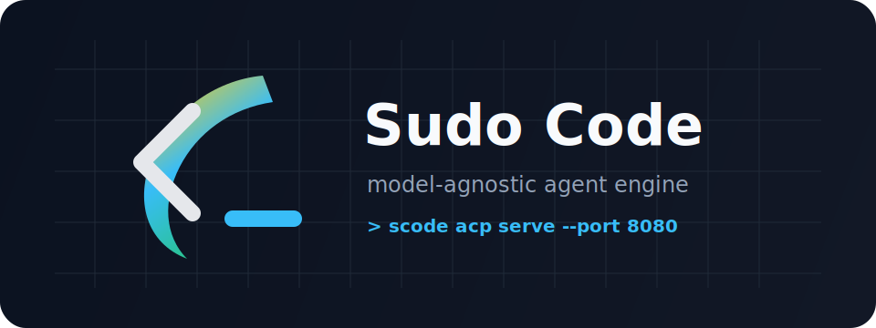
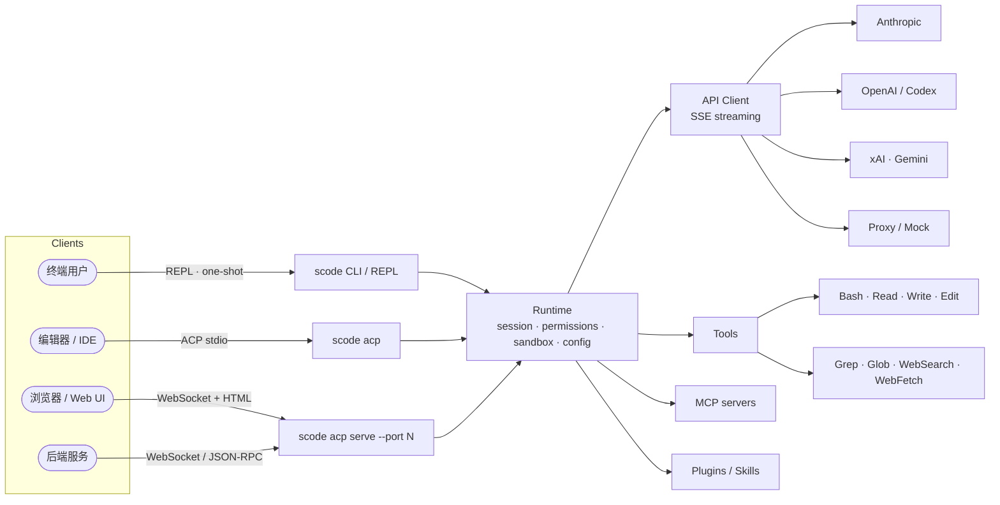

<!-- Language: [🇬🇧 English](./README.md) · 🇨🇳 简体中文 (this file) -->

# Sudo Code

<p align="center">
  
</p>

<p align="center">
  <a href="#license"></a>
  
  
  
  
  <a href="./CONTRIBUTING.md"></a>
</p>

<p align="center">
  <b>面向 AI 代理时代的引擎。</b><br/>
  Rust 原生 · 模型无关 · Headless 优先 · 默认安全。
</p>

<p align="center">
  
</p>

---

## Sudo Code 是什么？

**Sudo Code**（`scode`）是一个用 Rust 实现的高性能编码代理 —— 与 Claude
Code、Aider 等同属一类 —— 从一开始就同时面向两类使用者：终端前的开发者与
网络上的程序。

- **模型无关。** 一等公民式支持 Anthropic、OpenAI、xAI、Gemini，并支持
  OAuth 订阅与任意代理后端。模型别名与提供方差异见
  [`docs/models.md`](./docs/models.md)。
- **性能优先。** Rust + `tokio` 的单一原生二进制，内存占用紧凑，关停可
  预测，负载下资源用量稳定。
- **Headless 优先。** `scode acp` 与 `scode acp serve` 在 stdio 与
  WebSocket 两种传输上暴露 Agent Communication Protocol。详见
  [`docs/acp.md`](./docs/acp.md)。
- **内嵌 Web UI。** `scode acp serve --port 8080` 自带可在
  `http://localhost:8080/` 直接打开的交互客户端。详见
  [`docs/acp.md`](./docs/acp.md)。
- **默认安全。** 明确的权限模式与 Linux user-namespace 沙箱，详见
  [`docs/permissions-and-sandbox.md`](./docs/permissions-and-sandbox.md)。

## 架构



Cargo 工作空间结构见 [`rust/README.md`](./rust/README.md)。

## 安装

```bash
curl -fsSL https://raw.githubusercontent.com/sudoprivacy/sudocode/main/install.sh | sh
```

脚本会下载 `scode` 在当前平台的预构建二进制（macOS arm64/x64、Linux
x64/arm64）并验证 SHA-256 校验和。macOS Apple Silicon 安装到
`/opt/homebrew/bin`；macOS x64 与 Linux 安装到 `/usr/local/bin`，仅在
stdin 是 TTY 时才会请求 `sudo`。若系统目录不可写且 `sudo` 不可用，会回
退到 `$HOME/.local/bin`。Windows 用户可从
[Releases 页面](https://github.com/sudoprivacy/sudocode/releases/latest)
下载 zip。

可选覆盖：

- `SCODE_VERSION=v0.1.5 sh install.sh` — 锁定指定版本。
- `sh install.sh --no-sudo` — 安装到 `$HOME/.local/bin`。
- `SCODE_INSTALL_DIR=$HOME/.local/bin sh install.sh` — 显式按用户安装。
- `sh install.sh --prefix /usr/local` — 显式安装前缀。

国内镜像（校验和仍以 GitHub 为准）：

```bash
SCODE_MIRROR=https://sudowork-download-1309794936.cos.ap-beijing.myqcloud.com/sudocode/release/latest \
  curl -fsSL https://raw.githubusercontent.com/sudoprivacy/sudocode/main/install.sh | sh
```

## 从源码构建

```bash
git clone https://github.com/sudoprivacy/sudocode.git
cd sudocode/rust
cargo build --release
# 产物位置: ./target/release/scode
```

需要一个较新的 Rust 2021 稳定工具链。

## 快速开始

```bash
# 选择认证方式（详见 docs/authentication.md）
export CLAUDE_CODE_OAUTH_TOKEN="sk-ant-oat-..."

# 交互式 REPL
scode

# 单次提问
scode "explain this codebase"

# 健康检查
scode doctor
```

日常使用流程见 [`docs/usage.md`](./docs/usage.md)。

## 文档

- [`docs/usage.md`](./docs/usage.md) — REPL、单次提问、JSON 输出、resume、doctor。
- [`docs/authentication.md`](./docs/authentication.md) — 认证模式与凭据。
- [`docs/permissions-and-sandbox.md`](./docs/permissions-and-sandbox.md) — 权限模式与 Linux 沙箱。
- [`docs/acp.md`](./docs/acp.md) — ACP 传输与内嵌 Web UI。
- [`docs/models.md`](./docs/models.md) — 模型别名与提供方差异。
- [`docs/plugins_zh.md`](./docs/plugins_zh.md) — 编写与使用 `scode` 插件。
- [`docs/container.md`](./docs/container.md) — 在容器中构建与运行。
- [`docs/parity.md`](./docs/parity.md) — claude-code 对齐口径与跟踪机制。
- [`docs/mock-parity-harness.md`](./docs/mock-parity-harness.md) — 确定性 mock 后端与 harness。
- [`ROADMAP.html`](./ROADMAP.html) — 项目目标。
- [`rust/README.md`](./rust/README.md) — Cargo 工作空间结构。

## 参与贡献

开发环境、必跑检查、PR 流程见 [`CONTRIBUTING.md`](./CONTRIBUTING.md)。

## 许可证

以 MIT 许可证发布。各 crate 的 license 字段见
[`rust/Cargo.toml`](./rust/Cargo.toml)。

---

Sudo Code 是由 Sudo Privacy 社区维护的项目。
